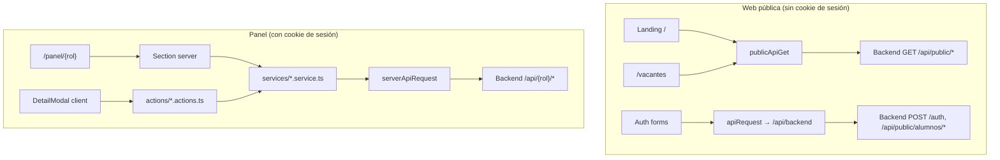
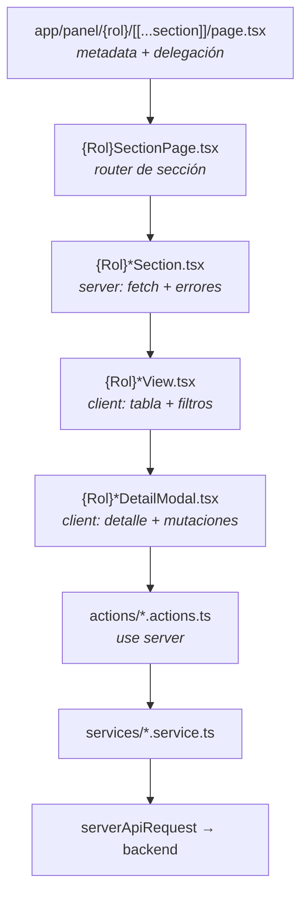
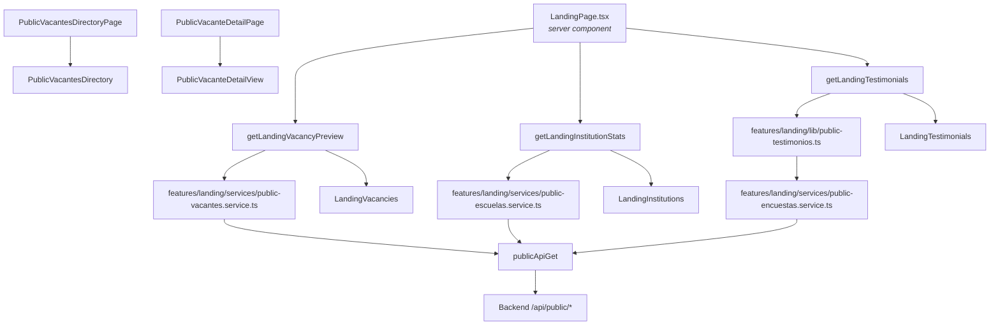
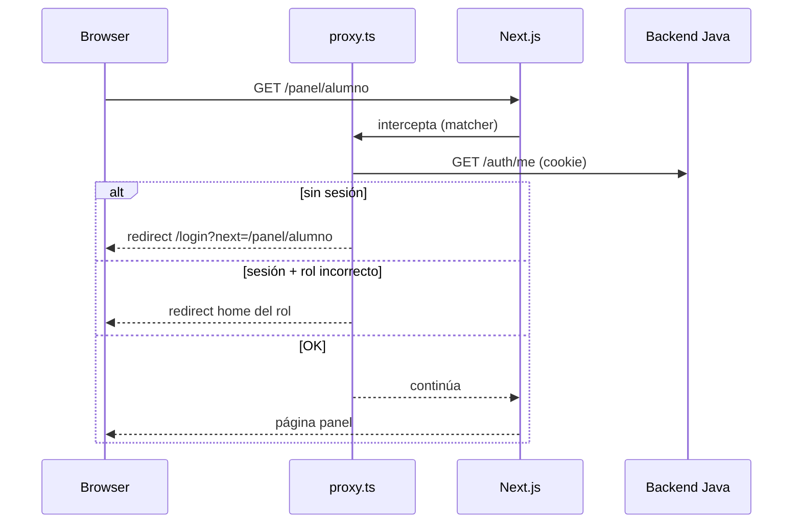
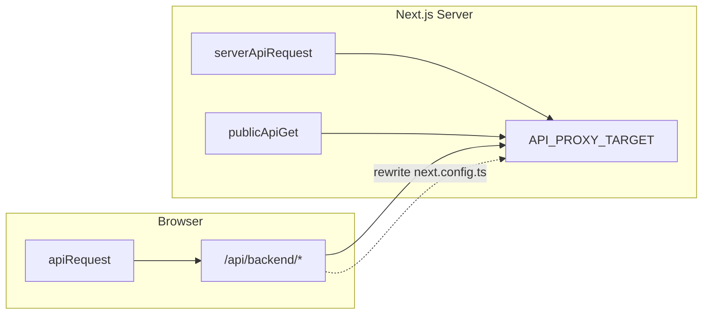
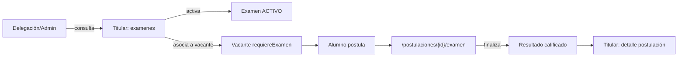
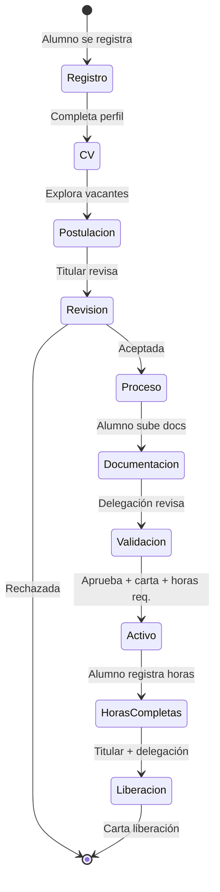

# Arquitectura del frontend — Servicio Social Edomex

Documentación actualizada del repositorio `front-servicio-social`. Describe **cómo está organizado el código**, **cómo fluyen los datos** y **cómo se relacionan** la web pública, la autenticación y el panel por roles.

**Backend relacionado:** `../Back_end/dgp-servicio-social-service` (Java, puerto `8080`).

---

## 1. Propósito del sistema

Plataforma web para que estudiantes del Estado de México realicen **servicio social, prácticas profesionales o residencias** en dependencias del gobierno estatal.

| Actor | Qué hace en la plataforma |
|-------|---------------------------|
| **Público** | Consulta landing, directorio de vacantes, registro |
| **Alumno** | CV, postulación, proceso (horas, documentos, cartas) |
| **Titular de área** | Vacantes, postulaciones, seguimiento de alumnos asignados |
| **Delegación** | Publicar vacantes, validar documentos/horas, liberaciones |
| **Admin** | Catálogos: dependencias, escuelas, áreas, usuarios |
| **Enlace escolar** | Consulta read-only de alumnos/procesos de su escuela |

---

## 2. Stack técnico

| Tecnología | Versión / nota |
|------------|----------------|
| Next.js (App Router) | 16.x |
| React | 19.x |
| TypeScript | 5.x |
| Estilos | CSS Modules + variables en `src/styles/variables.css` (sin Tailwind) |
| Iconos | `lucide-react` |
| Toasts | `sonner` |
| Skeletons | `react-loading-skeleton` |

**Scripts** (`package.json`):

| Comando | Acción |
|---------|--------|
| `npm run dev` | Servidor desarrollo `:3000` |
| `npm run build` | Build producción |
| `npm run start` | Servir build |
| `npm run lint` | ESLint |
| `npm run typecheck` | TypeScript sin emit |
| `npm run check` | typecheck + lint |

---

## 3. Mapa del repositorio

```
front-servicio-social/
├── src/
│   ├── app/                    # Rutas Next.js (delgadas)
│   │   ├── page.tsx            # Landing /
│   │   ├── login/                # Auth
│   │   ├── registro/
│   │   ├── recuperar-contrasena/
│   │   ├── vacantes/           # Directorio público
│   │   └── panel/              # Panel por rol
│   ├── features/               # Lógica por dominio
│   │   ├── landing/            # Web pública
│   │   ├── auth/               # Login, registro, reset
│   │   ├── panel/              # Shell compartido del panel
│   │   ├── admin/
│   │   ├── delegacion/
│   │   ├── titular/
│   │   ├── alumno/
│   │   └── enlace/
│   ├── lib/                    # Infraestructura compartida
│   │   ├── api/                # HTTP cliente/servidor/público
│   │   ├── auth/               # Roles, sesión, rutas
│   │   ├── domain/             # Reglas de negocio y tipos base
│   │   ├── actions/            # runAuthorizedAction, runServerAction, ActionResult
│   │   └── cache/              # revalidate-panel
│   ├── shared/                 # UI reutilizable (DataTable, Modal, Form…)
│   ├── proxy.ts                # Guard de auth/roles (Next 16)
│   └── styles/                 # reset, variables, accessibility
├── docs/                       # Esta documentación
├── public/                     # Assets estáticos
├── .env.example
└── next.config.ts              # Proxy /api/backend → backend Java
```

---

## 4. Dos mundos: público vs panel

El frontend tiene **dos formas distintas** de hablar con el backend. No mezclar patrones.



| Aspecto | Web pública | Panel interno |
|---------|-------------|---------------|
| Autenticación | No (excepto forms auth) | Cookie de sesión |
| Fetch servidor | `publicApiGet` (`lib/api/public-request.ts`) | `serverApiRequest` (`lib/api/server-request.ts`) |
| Fetch cliente | `apiRequest` → proxy `/api/backend` | No llamar API directo desde cliente |
| Mutaciones | Formularios auth en cliente | Server Actions + `runAuthorizedAction` |
| Caché | ISR `revalidate: 120s` | `revalidatePanelSection` tras mutación |
| Errores | `loadError` + `LandingPublicLoadAlert` | `Alert` en Section / modal |

---

## 5. Rutas de la aplicación

### 5.1 Rutas públicas

| URL | Archivo app | Feature |
|-----|-------------|---------|
| `/` | `src/app/page.tsx` | `LandingPage` |
| `/vacantes` | `src/app/vacantes/page.tsx` | `PublicVacantesDirectoryPage` |
| `/vacantes/[id]` | `src/app/vacantes/[id]/page.tsx` | `PublicVacanteDetailPage` |

**Secciones del landing** (anclas):

| ID | Componente |
|----|------------|
| `#inicio` | `LandingHero` |
| `#como-registro` | `LandingAbout` |
| `#proceso` | `LandingTimeline` |
| `#vacantes` | `LandingVacancies` |
| `#testimoniales` | `LandingTestimonials` |
| `#instituciones` | `LandingInstitutions` |
| `#preguntas-frecuentes` | `LandingFaq` |

### 5.2 Rutas de autenticación

| URL | Archivo | Guest-only |
|-----|---------|------------|
| `/login` | `src/app/login/page.tsx` | Sí — `?next=` sanitizado con `isSafeInternalPath` |
| `/registro` | `src/app/registro/page.tsx` | Sí — sin token; `?token=` redirige al path |
| `/registro/[token]` | `src/app/registro/[token]/page.tsx` | Sí — invitación de escuela (forma preferida) |
| `/registro/alumno` | redirect → `/registro` o `/registro/{token}` | Sí |
| `/recuperar-contrasena` | `src/app/recuperar-contrasena/page.tsx` | Sí |
| `/restablecer-contrasena` | `src/app/restablecer-contrasena/page.tsx` | Sí — sin token muestra error; `?token=` redirige al path |
| `/restablecer-contrasena/[token]` | `src/app/restablecer-contrasena/[token]/page.tsx` | Sí — forma preferida del enlace del correo |

**Registro con escuela:** invitaciones generan `/registro/{token}` (`invitation-link.ts`). Legacy `?token=` redirige al path. `Referrer-Policy: no-referrer` en `/registro/:path*`.

**Recuperación de contraseña:** `ResetPasswordFlow` → `POST /auth/password/forgot` → correo con `/restablecer-contrasena/{token}` → `ResetPasswordTokenForm` → `POST /auth/password/reset`. Legacy `?token=` redirige al path. `Referrer-Policy: no-referrer` en esas rutas.

**Post-registro:** el formulario redirige a login.

**Fuente única de rutas auth:** `src/lib/auth/constants.ts` → `AUTH_PATHS`  
**Reexport en features:** `src/features/auth/constants/routes.ts` → `AUTH_ROUTES`  
**Storage post-registro:** `src/features/auth/constants/storage.ts`  
**Checklist de seguridad:** [SEGURIDAD.md](./SEGURIDAD.md)

### 5.3 Rutas del panel

Patrón: `/panel/{rol}/[[...section]]`

| Rol | URL base | Archivo page | Layout especial |
|-----|----------|--------------|-----------------|
| Alumno | `/panel/alumno` | `panel/alumno/[[...section]]/page.tsx` | `AlumnoPanelLayout` + guard CV |
| Delegación | `/panel/delegacion` | `panel/delegacion/...` | `RolePanelLayout` |
| Titular | `/panel/titular` | `panel/titular/...` | `RolePanelLayout` |
| Admin | `/panel/admin` | `panel/admin/...` | `RolePanelLayout` |
| Enlace | `/panel/enlace` | `panel/enlace/...` | `RolePanelLayout` |

`/panel` → redirect al home del rol (`src/app/panel/page.tsx`).

**Navegación lateral:** definida en `src/features/panel/constants/navigation.ts` (`PANEL_NAVIGATION`).

---

## 6. Navegación del panel por rol

```mermaid
flowchart LR
  subgraph ALUMNO["ROLE_ALUMNO"]
    A1[inicio] --> A2[vacantes]
    A2 --> A3[postulaciones]
    A3 --> A4[proceso]
    A4 --> A5[cv]
  end

  subgraph DELEGACION["ROLE_DELEGACION"]
    D1[inicio] --> D2[vacantes]
    D2 --> D3[postulaciones]
    D3 --> D4[procesos]
    D4 --> D5[validacion]
    D5 --> D6[alumnos]
    D6 --> D7[encuestas]
    D7 --> D8[examenes]
    D8 --> D9[reportes]
  end

  subgraph TITULAR["ROLE_TITULAR_AREA"]
    T1[inicio] --> T2[vacantes]
    T2 --> T3[postulaciones]
    T3 --> T4[examenes]
    T4 --> T5[procesos]
  end

  subgraph ADMIN["ROLE_ADMINISTRADOR"]
    AD1[inicio] --> AD2[dependencias]
    AD2 --> AD3[escuelas]
    AD3 --> AD4[areas]
    AD4 --> AD5[examenes]
    AD5 --> AD6[usuarios]
  end

  subgraph ENLACE["ROLE_ENLACE_ESCOLAR"]
    E1[inicio] --> E2[alumnos]
    E2 --> E3[procesos]
    E3 --> E4[reportes]
  end
```



### Sub-rutas anidadas

| Rol | Patrón URL | Secciones |
|-----|------------|-----------|
| Alumno | `/panel/alumno/proceso/{slug}` | `resumen`, `horas`, `documentos`, `cartas`, `incidencias` |
| Alumno | `/panel/alumno/postulaciones/{idPostulacion}/examen` | Examen diagnóstico en línea (página dedicada) |
| Delegación | `/panel/delegacion/validacion/{slug}` | `documentos`, `horas`, `incidencias` |
| Titular | `/panel/titular/procesos` (+ incidencias en modal) | Seguimiento por alumno |

Constantes de slugs: `src/features/{rol}/constants/sections.ts` (y archivos `*-sections.ts` para sub-rutas).

---

## 7. Arquitectura del panel (capas)

Patrón estándar **obligatorio** para pantallas internas:



| Capa | Ubicación típica | Responsabilidad |
|------|------------------|-----------------|
| **Page** | `src/app/panel/{rol}/` | Solo metadata y `<RolSectionPage />` |
| **SectionPage** | `src/features/{rol}/{Rol}SectionPage.tsx` | Valida slug, renderiza Section correcta |
| **Section** | `src/features/{rol}/sections/` | `serverApiRequest`, manejo error con `Alert`, pasa props a View |
| **View** | `src/features/{rol}/components/{seccion}/` | `"use client"`, `DataTable`, abre modales |
| **Modal** | `*DetailModal.tsx` | Detalle, formularios, llama actions |
| **Actions** | `src/features/{rol}/actions/` | `runAuthorizedAction`, `revalidate{Rol}Section` |
| **Services** | `src/features/{rol}/services/` | HTTP tipado al backend |
| **Types** | `src/features/{rol}/types/` | DTOs alineados con Java |
| **Lib (gates)** | `src/features/{rol}/lib/` o `lib/domain/` | Reglas UI (mostrar/ocultar botones) |

**Regla crítica:** los componentes cliente del panel **nunca** llaman `serverApiRequest` directamente.

Convenciones detalladas: [PANEL_CONVENTIONS.md](./PANEL_CONVENTIONS.md).

---

## 8. Arquitectura web pública (landing + vacantes)



### Servicios públicos

| Archivo | Endpoint | Uso |
|---------|----------|-----|
| `features/landing/services/public-vacantes.service.ts` | `GET /api/public/vacantes`, `GET /api/public/vacantes/{id}` | Landing + directorio |
| `features/landing/services/public-escuelas.service.ts` | `GET /api/public/escuelas/estadisticas` | Tarjetas instituciones |
| `features/landing/lib/public-testimonios.ts` | Encuestas de satisfacción vía `public-encuestas.service.ts` | Testimonios en landing |
| `features/landing/lib/public-data.ts` | — | Mapeo `{ data, loadError? }` para secciones públicas |

### Cliente HTTP público

`src/lib/api/public-request.ts`:

```typescript
publicApiGet<T>(path) →
  | { ok: true, data: T }
  | { ok: false, reason: "not_found" | "unavailable" }
```

- Sin cookies
- ISR: `revalidate: 120` segundos
- Resultado mapeado en `features/landing/lib/public-data.ts` → `{ data, loadError? }`

### Estados de UI pública

| Situación | Comportamiento |
|-----------|----------------|
| API OK + datos | Tarjetas / listado |
| API OK + vacío | Empty state (“No hay vacantes…”) |
| API falla | `LandingPublicLoadAlert` (error visible, no fingir vacío) |
| Detalle 404 | `notFound()` de Next.js |
| Detalle error servidor | Alert en página de detalle |

### Auth (formularios)

| Archivo | Endpoints |
|---------|-----------|
| `auth/services/auth.service.ts` | `POST /auth/login`, `GET /auth/me`, `POST /auth/logout` |
| `auth/services/register.service.ts` | `GET /api/public/registro/tokens/{token}`, `POST /api/public/alumnos/registro-*` |
| `auth/services/password-reset.service.ts` | `POST /auth/password/forgot`, `POST /auth/password/reset` |

Auth usa `apiRequest` (cliente) → `/api/backend` (proxy). **No** usa server actions (patrón distinto al panel, válido para forms de login).

---

## 9. Autenticación y proxy



**Archivos clave:**

| Archivo | Función |
|---------|---------|
| `src/proxy.ts` | Guard guest-only y panel (convención Next 16) |
| `src/lib/auth/session.middleware.ts` | `getSessionFromRequest` |
| `src/lib/auth/session.server.ts` | `getServerSession` en RSC |
| `src/lib/auth/roles.ts` | `canAccessPath`, `resolveHomePath` |
| `src/lib/auth/constants.ts` | Roles, paths, prioridad |

**Roles** (`USER_ROLES`):

| Constante | Home path |
|-----------|-----------|
| `ROLE_ADMINISTRADOR` | `/panel/admin` |
| `ROLE_DELEGACION` | `/panel/delegacion` |
| `ROLE_TITULAR_AREA` | `/panel/titular` |
| `ROLE_ENLACE_ESCOLAR` | `/panel/enlace` |
| `ROLE_ALUMNO` | `/panel/alumno` |

**Matcher del proxy:** `/panel/:path*`, `/login`, `/registro`, `/registro/:path*`, `/recuperar-contrasena`, `/restablecer-contrasena/:path*`

Detalle de controles: [SEGURIDAD.md](./SEGURIDAD.md).

---

## 10. Capa HTTP (`lib/api`)



| Función | Archivo | Cuándo usar |
|---------|---------|-------------|
| `apiRequest` | `client.ts` | Formularios auth en browser |
| `serverApiRequest` | `server-request.ts` | Sections, services, actions del panel |
| `publicApiGet` | `public-request.ts` | Landing, vacantes públicas (ISR) |
| `serverDownloadRequest` | `download.ts` | Excel/PDF con cookies |
| `buildQuery` | `query.ts` | Query strings en services |

**Variables de entorno** (`.env.example`):

| Variable | Uso |
|----------|-----|
| `API_PROXY_TARGET` | URL backend Java (obligatoria en producción; default dev `http://localhost:8080`) |
| `NEXT_PUBLIC_API_URL` | Base browser (default `/api/backend`) |
| `NEXT_PUBLIC_SITE_URL` | URL pública del sitio (SEO, sitemap, enlaces de invitación) |
| `NEXT_PUBLIC_SENTRY_DSN` | Opcional — Sentry server (`instrumentation.ts`) + boundaries |
| `SENTRY_TRACES_SAMPLE_RATE` | Opcional — sampling server (default `0.1`) |

**Límite uploads:** `serverActions.bodySizeLimit: "2mb"`.

**Health:** `GET /api/health` → `{ status, backend: "up"|"down" }` (liveness siempre 200).

**Proxy** (`next.config.ts`):

```
/api/backend/:path*  →  ${API_PROXY_TARGET}/:path*
```

**Importante:** el proxy no autoriza. El backend debe validar cada request. Ver [SEGURIDAD.md](./SEGURIDAD.md) §5.
---

## 11. Dominio compartido (`lib/domain`)

Reglas de negocio y tipos **independientes del rol**. Todo el panel y la web pública extienden estas bases.

### Tipos base (`types.ts`)

`VacanteBase`, `PostulacionBase`, `ProcesoBase`, `IncidenciaBase`, `AlumnoBase`, `NotificacionBase`

### Módulos de reglas

| Archivo | Contenido |
|---------|-----------|
| `proceso.ts` | Gates: activación, horas completas, liberación, evaluación |
| `postulacion.ts` | Aceptar, rechazar, cancelar; gates de examen (`canContestarExamen`, `isExamenFinalizado`) |
| `vacante.ts` | Publicar, cerrar, pausar, editar |
| `documento.ts` | Subir, aprobar, observar, rechazar |
| `horas.ts` | Validar/observar/rechazar horas; máx. 12 h/día alumno |
| `incidencia.ts` | Resolver, cancelar |
| `cartas.ts` | Tipos de carta y descarga |
| `examen.ts` | Tipos de examen/pregunta; `puedeActivarExamen`, `getPreguntasActivas`, formatters |
| `modalidad.ts` | `SERVICIO_SOCIAL`, `PRACTICAS_PROFESIONALES`, `RESIDENCIAS` |
| `labels.ts` | `formatEtiqueta`, `estatusTone`, `formatFecha` (es-MX) |
| `requests.ts` | DTOs de mutación compartidos (`motivo`, `comentario`, etc.) |

**Principio:** si el backend rechazaría una acción por estatus, la UI no muestra el botón (gate en `lib/domain` o `features/{rol}/lib`).

---

## 12. Features por rol (inventario)

### Admin — `src/features/admin`

| Sección | URL | Service principal |
|---------|-----|-------------------|
| inicio | `/panel/admin` | dashboard |
| dependencias | `/panel/admin/dependencias` | `dependencias.service.ts` |
| escuelas | `/panel/admin/escuelas` | `escuelas.service.ts` |
| areas | `/panel/admin/areas` | `areas.service.ts` |
| examenes | `/panel/admin/examenes` | `ExamenesMonitorView` (shared, solo lectura) |
| usuarios | `/panel/admin/usuarios` | `usuarios.service.ts` |

API: `/api/dependencias`, `/api/escuelas`, `/api/areas`, `/api/admin/usuarios-internos`

### Delegación — `src/features/delegacion`

| Sección | URL | Notas |
|---------|-----|-------|
| inicio | `/panel/delegacion` | Dashboard |
| vacantes | `.../vacantes` | Publicar / rechazar / cerrar |
| postulaciones | `.../postulaciones` | Supervisión |
| procesos | `.../procesos` | Alumnos en servicio social |
| validacion | `.../validacion/{documentos\|horas\|incidencias}` | Composite |
| alumnos | `.../alumnos` | Normalización de escuela (Vinculaciones) |
| encuestas | `.../encuestas` | Moderación de testimonios/comentarios públicos |
| examenes | `.../examenes` | Consulta de exámenes diagnóstico por área |
| reportes | `.../reportes` | Export Excel |

API: `/api/delegacion/*`

### Titular — `src/features/titular`

| Sección | URL |
|---------|-----|
| inicio | `/panel/titular` |
| vacantes | `/panel/titular/vacantes` | CRUD, `requiereExamen`, asociación examen al crear/editar |
| postulaciones | `/panel/titular/postulaciones` | Aceptar/rechazar; resultado automático del examen en detalle |
| examenes | `/panel/titular/examenes` | CRUD preguntas, activar/desactivar examen |
| procesos | `/panel/titular/procesos` | Horas, incidencias, liberación, evaluación |

API: `/api/titular/*`

### Alumno — `src/features/alumno`

| Sección | URL | Notas |
|---------|-----|-------|
| inicio | `/panel/alumno` | Notificaciones |
| vacantes | `.../vacantes` | Postulación |
| postulaciones | `.../postulaciones` | Estado; enlace a examen si aplica |
| examen en línea | `.../postulaciones/{id}/examen` | `AlumnoExamenSection` → `AlumnoExamenPostulacionView` |
| proceso | `.../proceso/{sub}` | Horas, docs, cartas; encuesta satisfacción vía `registerEncuestaSatisfaccionAction` |
| cv | `.../cv` | **Gate:** nav bloqueada hasta CV completo |

API: `/api/alumno/*`, `/api/notificaciones/*`  
Mutaciones: siempre `runAuthorizedAction` + `compactPayload` (ver [SEGURIDAD.md](./SEGURIDAD.md) §3.B).

### Enlace — `src/features/enlace`

| Sección | URL | Mutaciones |
|---------|-----|------------|
| inicio | `/panel/enlace` | — |
| alumnos | `.../alumnos` | Solo lectura |
| procesos | `.../procesos` | Solo lectura |
| reportes | `.../reportes` | Export |

API: `/api/enlace/*`

### Panel shell — `src/features/panel`

Sin services propios. Provee:

- `PanelLayout`, `PanelSidebar`, `RolePanelLayout`
- `PanelSectionSkeleton` (loading.tsx)
- `usePanelRouter` (refresh tras mutación)
- `constants/navigation.ts`

---

## 12.1 Módulo de exámenes diagnóstico

Flujo transversal entre titular, alumno y supervisión.



| Capa | Ubicación | Uso |
|------|-----------|-----|
| Dominio | `lib/domain/examen.ts`, `postulacion.ts` | Tipos, gates, formatters |
| UI compartida | `shared/components/examen/` | `ExamenBuilder`, `ExamenOverview`, `ExamenPreguntaPreview`, columnas de listado |
| Titular | `features/titular/components/examenes/` | `TitularExamenesView`, `TitularExamenManageModal`, `TitularExamenPreguntaEditor` |
| Titular vacantes | `TitularVacanteFormModal`, `TitularVacanteExamenPanel` | Selector al marcar `requiereExamen`; cache local `lib/vacante-examen-cache.ts` |
| Titular postulación | `TitularPostulacionExamenResultado` | Resumen + tabla de respuestas en modal `size="wide"` |
| Delegación/Admin | `ExamenesMonitorView` + detail modal shared | Solo lectura |
| Alumno | `features/alumno/components/examen/` | Contestar examen con timer e intro modal |

**API titular:** `/api/titular/examenes/*`, `/api/titular/vacantes/{id}/examen` (POST/DELETE asociar).  
**API alumno:** `/api/alumno/postulaciones/{id}/examen/*`.  
**API delegación:** `/api/delegacion/examenes/*` (monitor).

**Nota frontend:** el detalle de vacante no expone `idExamen` en GET; la UI titular persiste la asociación reciente en `localStorage` (`vacante-examen-cache.ts`) y aplica heurística si solo hay un examen activo en el área.

---

## 13. Flujo de negocio principal



### Paso a paso (referencia)

1. **Admin** configura dependencias, escuelas, áreas, usuarios, tokens de invitación.
2. **Alumno** se registra (`/registro`) con o sin token de escuela.
3. Si escuela capturada a mano → **Delegación → Vinculaciones** normaliza.
4. **Alumno** completa CV → puede postular.
5. **Titular** crea vacante → envía a revisión.
6. **Delegación** publica vacante → visible en landing y `/vacantes`.
7. **Alumno** postula → si la vacante requiere examen, contesta en `/panel/alumno/postulaciones/{id}/examen` → **Titular** revisa resultado automático y acepta/rechaza.
8. Se crea **proceso** → alumno sube documentos.
9. **Delegación** valida documentos, define horas, emite carta de aceptación → proceso **ACTIVO**.
10. **Alumno** registra horas → titular/delegación validan.
11. **Titular** liberación técnica + evaluación final → **Delegación** carta de liberación.

Estatus de proceso (backend): `PENDIENTE_DOCUMENTACION` → … → `ACTIVO` → `HORAS_COMPLETAS` → `LIBERADO`.

---

## 14. Componentes compartidos (`shared/`)

| Carpeta | Uso |
|---------|-----|
| `components/DataTable/` | Tablas del panel |
| `components/DetailModal/` | `DetailModalHero`, shell de modales |
| `components/Form/` | Inputs, `SearchableSelect`, `PasswordInput` |
| `components/Button/` | Variantes: `primary`, `action`, `outline`, `success` |
| `components/StatusBadge/` | `EstatusBadge` + tonos |
| `components/Modal/` | Tamaños `md`, `lg`, `wide`, `xl`; prop opcional `className` |
| `components/examen/` | `ExamenBuilder`, `ExamenOverview`, `ExamenPreguntaPreview`, columnas |
| `proceso/` | `CartaGestionModal`, `DocumentoGestionModal`, `presentacion.utils` |
| `notifications/` | Toasts globales (`notify`) |
| `icons/` | Reexport lucide |

**Colores institucionales** (`src/styles/variables.css`):

- **Vino** (`--color-vino`) — marca, landing
- **Dorado** (`--color-dorado`) — acentos
- **Azul acción** (`--color-action`) — botones de operación en panel (`variant="action"`)

---

## 15. Caché y revalidación

| Contexto | Mecanismo |
|----------|-----------|
| Landing público | `next: { revalidate: 120 }` en `publicApiGet` |
| Panel tras mutación | `revalidate{Rol}Section()` → wrappers en `features/*/lib` → `src/lib/cache/revalidate-panel.ts` + `revalidate-roles.ts` |
| Modal tras mutación | `router.refresh()` + `reloadKey` en `useDetailModalLoader` |

---

## 16. Despliegue a producción

Guía completa: **[DEPLOY.md](./DEPLOY.md)**. Seguridad: **[SEGURIDAD.md](./SEGURIDAD.md)**.

### Checklist mínimo

- [ ] `API_PROXY_TARGET`, `NEXT_PUBLIC_SITE_URL` (y opcional Sentry) en hosting
- [ ] Node.js >= 22
- [ ] `npm run build` con las mismas env que prod
- [ ] Backend accesible; `/api/health` → `backend: "up"`
- [ ] HTTPS + cookies `HttpOnly`/`Secure`/`SameSite`
- [ ] Smoke por rol ([PANEL_PHASE0_BASELINE.md](./PANEL_PHASE0_BASELINE.md))
- [ ] Checklist seguridad §3.A ([SEGURIDAD.md](./SEGURIDAD.md))

### APIs públicas pendientes en backend (no bloquean prod)

| Endpoint | Sección afectada |
|----------|------------------|
| `GET /api/public/escuelas/estadisticas` | Instituciones → empty state |
| `GET /api/public/testimonios` | Testimonios → empty state |

---

## 17. Referencias cruzadas

| Necesitas… | Lee… |
|------------|------|
| Controles y checklists de seguridad | [SEGURIDAD.md](./SEGURIDAD.md) |
| Crear pantalla panel | [PANEL_CONVENTIONS.md](./PANEL_CONVENTIONS.md) |
| Probar antes de prod | [PANEL_PHASE0_BASELINE.md](./PANEL_PHASE0_BASELINE.md) |
| Desplegar / Docker | [DEPLOY.md](./DEPLOY.md) |
| DTOs del backend | `../Back_end/.../dto/` |
| Navegación panel | `src/features/panel/constants/navigation.ts` |
| Reglas Next.js 16 | `node_modules/next/dist/docs/` + `AGENTS.md` |
| Módulo exámenes | § 12.1 + `shared/components/examen/` |

---

*Última actualización: `c44d148` — token registro en path, health con backend, Docker standalone, Sentry instrumentation, [SEGURIDAD.md](./SEGURIDAD.md).*
