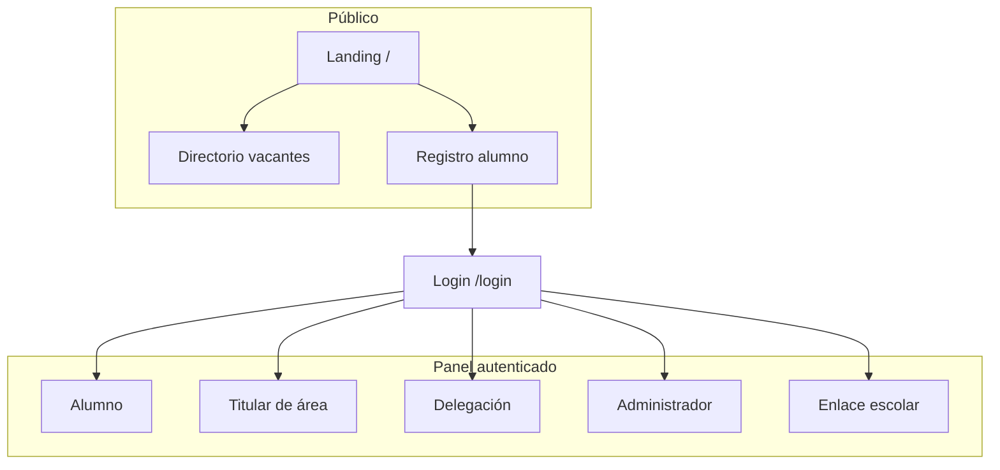
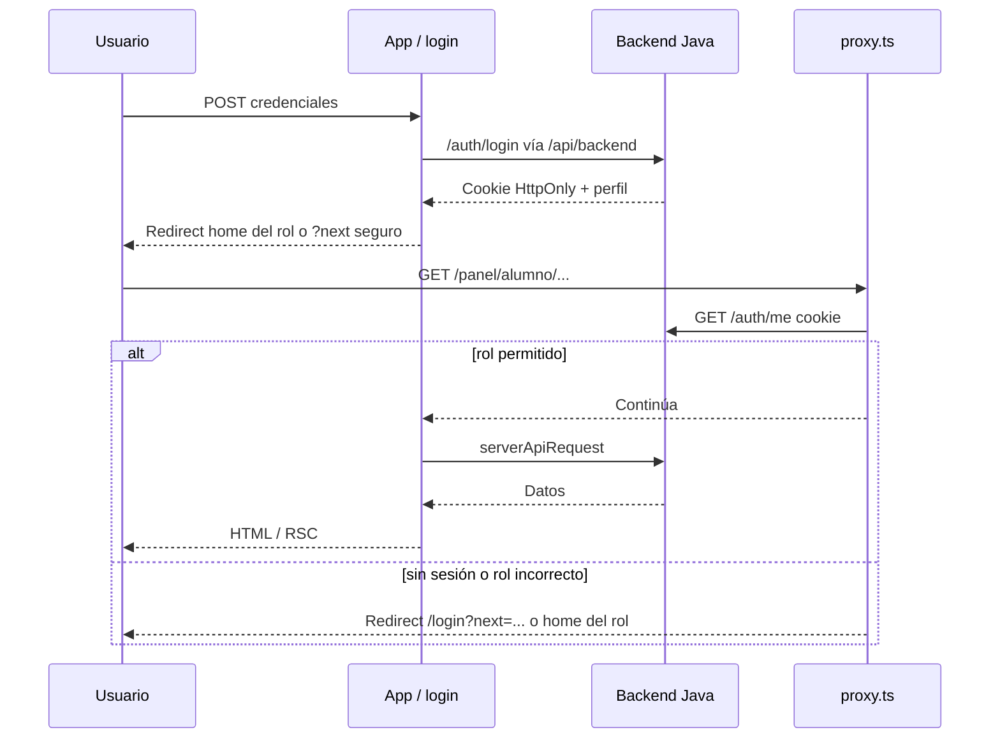
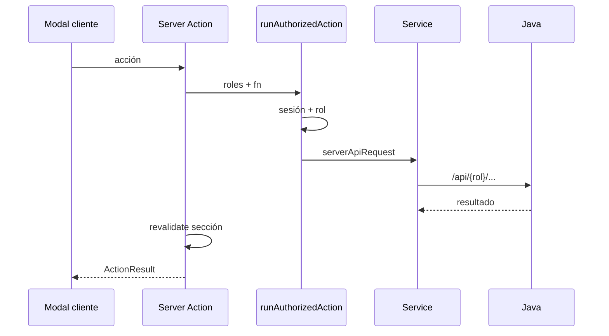
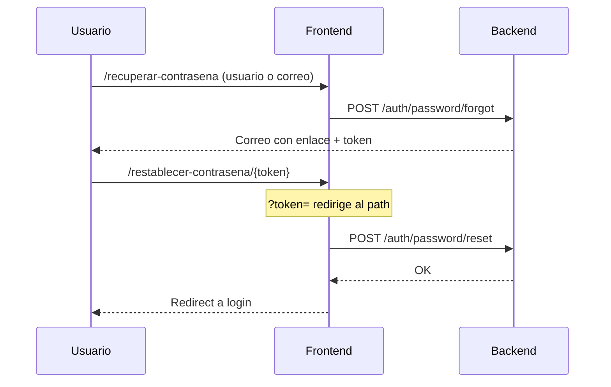
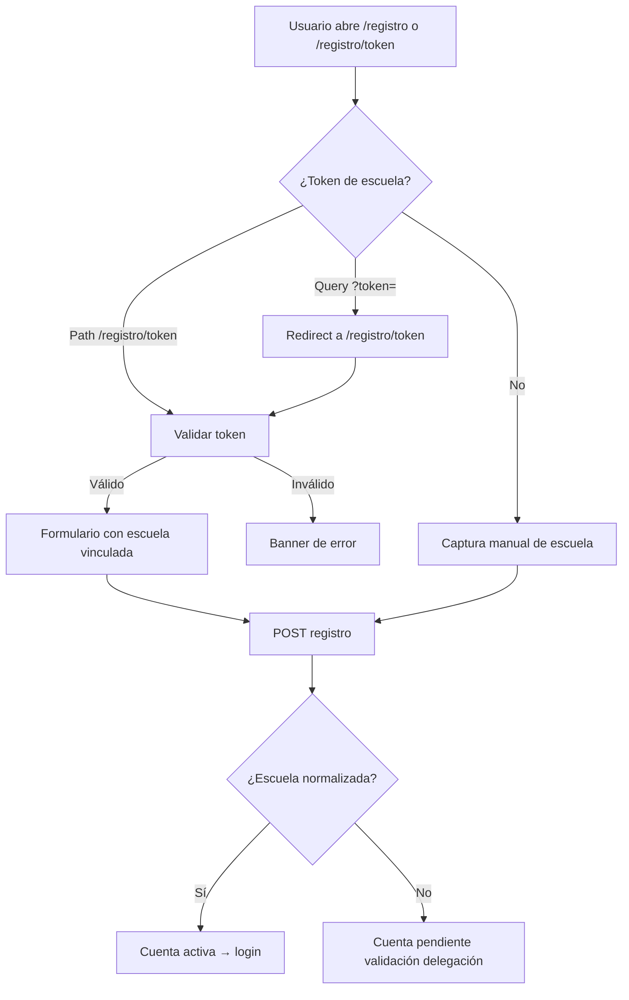
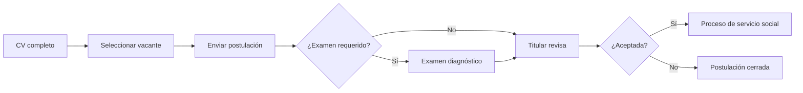
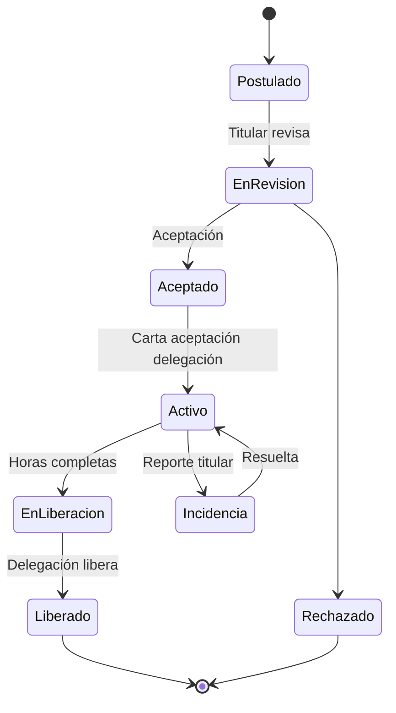
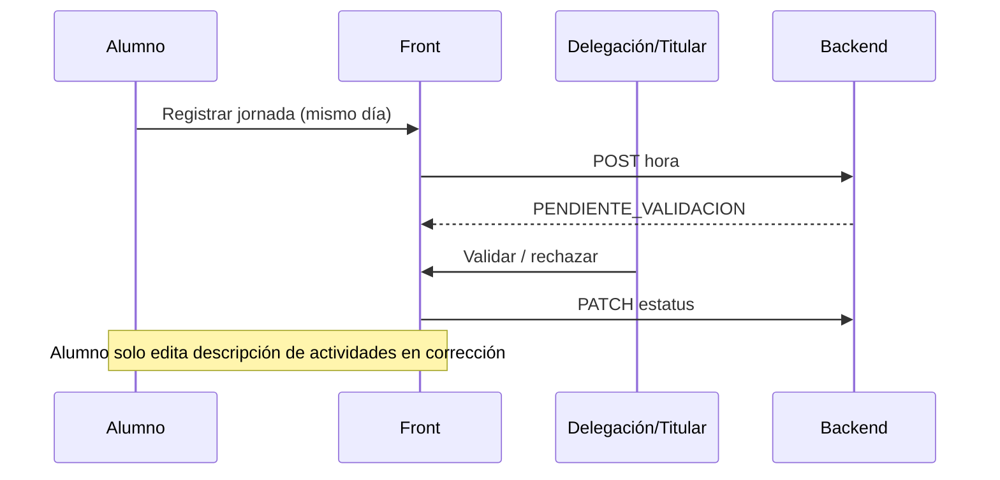
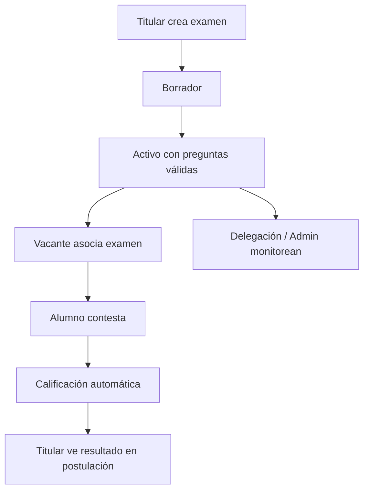
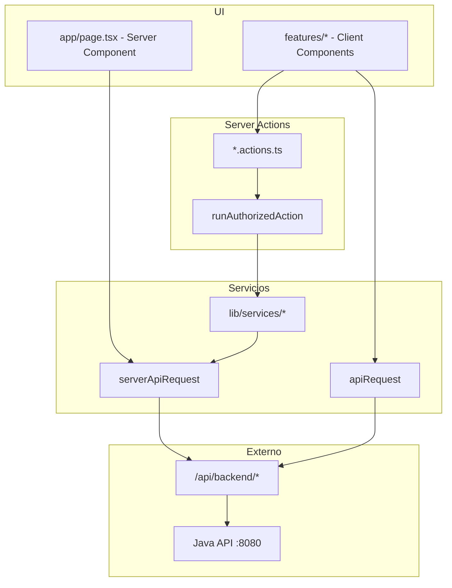

# Flujos del sistema — Servicio Social Edomex

Documentación gráfica de sesiones, roles, flujos de negocio y relaciones entre módulos del frontend.

Complementa [ARQUITECTURA.md](./ARQUITECTURA.md).

---

## 1. Roles y permisos



| Rol | Ruta base | Responsabilidad principal |
|-----|-----------|---------------------------|
| `ALUMNO` | `/panel/alumno` | CV, postulación, proceso activo |
| `TITULAR` | `/panel/titular` | Vacantes, postulaciones, seguimiento |
| `DELEGACION` | `/panel/delegacion` | Publicación, validación, liberación |
| `ADMIN` | `/panel/admin` | Catálogos globales |
| `ENLACE` | `/panel/enlace` | Consulta escolar read-only |

---

## 2. Sesión, autenticación y seguridad

> Detalle ampliado (capas, headers, checklists): **[SEGURIDAD.md](./SEGURIDAD.md)**.

### 2.1 Capas de defensa

```mermaid
flowchart TB
  U[Usuario] --> PX[proxy.ts rutas]
  PX -->|panel OK| RSC[RSC / panel]
  PX -->|sin sesión| L[/login]
  RSC -->|mutación| SA[runAuthorizedAction]
  SA --> API[Backend Java authz]
  U --> HDR[Headers CSP HSTS]
```

### 2.2 Secuencia de sesión



### 2.3 Mutación autorizada



### Reglas de sesión (frontend)

1. **Cookie httpOnly** — el token no se expone al JavaScript del navegador.
2. **`proxy.ts`** — primera línea: `/panel/*` exige sesión y rol; guest-only si ya hay sesión.
3. **Server Actions** — segunda línea: `runAuthorizedAction` valida rol antes del API.
4. **Redirects seguros** — `isSafeInternalPath` evita open redirects en `?next=`.
5. **El backend es la autoridad** — el front oculta UI; toda mutación debe rechazarse en API si no aplica.
6. **Dos “proxies”** — `proxy.ts` = guard de rutas; rewrite `/api/backend` = reenvío HTTP al Java (`API_PROXY_TARGET`).

### Recuperación de contraseña



Archivos: `src/features/auth/reset-password/`, `password-reset.service.ts`.

Archivos clave de seguridad:

- `src/proxy.ts`
- `src/lib/auth/` — roles, redirects, sesión
- `src/lib/actions/run-authorized-action.ts`
- `next.config.ts` — CSP / HSTS / rewrite
- [SEGURIDAD.md](./SEGURIDAD.md) — flujos Mermaid completos

---

## 3. Flujo de registro de alumno



**Reglas de negocio:**

- Con token: la escuela queda vinculada automáticamente. URL canónica: `/registro/{token}`.
- Sin token: `escuelaTextoCapturada` requiere normalización por delegación antes de postularse.
- Aviso de privacidad obligatorio.
- Invitaciones: `invitation-link.ts` → siempre path (no query).

---

## 4. Flujo de postulación (alumno)



**Guards en front:**

- `hasAlumnoCvPostulacionMotivo` — redirige a CV si intenta postular sin completarlo.
- `postulacion-entry` — rutas de entrada unificadas.
- Dominio en `src/lib/domain/cv.ts` — campos obligatorios del CV.

---

## 5. Ciclo de vida del proceso



### Horas de servicio



Componentes compartidos: `src/shared/proceso/horas/` (calendario, utilidades, modal alumno/titular).

---

## 6. Exámenes diagnóstico



Servicios compartidos:

- `src/lib/services/examenes-monitor.service.ts`
- `src/lib/actions/examenes-monitor.actions.ts` (roles `DELEGACION` + `ADMIN`)
- `src/shared/components/examen/ExamenesMonitorView.tsx`

---

## 7. Capas de datos



---

## 8. Seguridad en el front

Documento completo con capas y flujos Mermaid: **[SEGURIDAD.md](./SEGURIDAD.md)**.

| Control | Ubicación |
|---------|-----------|
| Headers (CSP, HSTS prod, X-Frame-Options, script-src-attr) | `next.config.ts` |
| Guard de rutas (Next 16) | `src/proxy.ts` |
| Rewrite HTTP al Java | `/api/backend` → `API_PROXY_TARGET` |
| Guards en actions | `runAuthorizedAction` |
| Payloads sin `undefined` | `compactPayload` |
| Tokens en path (registro / reset) | `registro/[token]`, `restablecer-contrasena/[token]` |
| Paths internos seguros | `isSafeInternalPath` |
| Fronteras de features | `eslint.config.mjs` |
| Health + backend probe | `/api/health` |
| Sin `poweredBy` | `next.config.ts` |

**Limitación conocida:** el rewrite `/api/backend` expone el API al navegador; el backend debe autorizar cada endpoint. No confundir con `proxy.ts` (guard de rutas).

---

## 9. Comandos de calidad

```bash
npm run typecheck
npm run lint
npm run check
npm run test
npm run test:coverage
npm run test:e2e          # públicas, auth, a11y, health, registro token path
npm run test:e2e:panel    # smoke + axe por rol (requiere E2E_*)
npm run analyze
npm run build
```

CI (`.github/workflows/ci.yml`):

1. **quality:** typecheck → lint → coverage → audit high → build
2. **e2e:** build → Playwright (públicas / auth / a11y / health)

Despliegue: [DEPLOY.md](./DEPLOY.md). Seguridad: [SEGURIDAD.md](./SEGURIDAD.md).

---

## 10. Índice de reglas de negocio por módulo

| Módulo | Archivo dominio |
|--------|-----------------|
| CV alumno | `src/lib/domain/cv.ts` |
| Horas | `src/lib/domain/horas.ts` |
| Proceso / estatus | `src/lib/domain/proceso.ts` |
| Postulación | `src/lib/domain/postulacion.ts` |
| Examen | `src/lib/domain/examen.ts` |
| Etiquetas / fechas | `src/lib/domain/labels.ts` |

*Última actualización: `c44d148`.*
Export central: `src/lib/domain/index.ts`.
