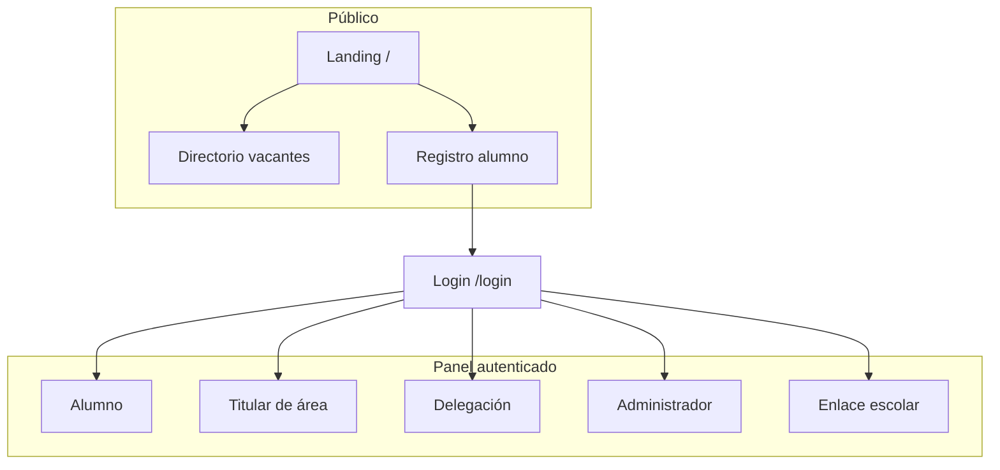
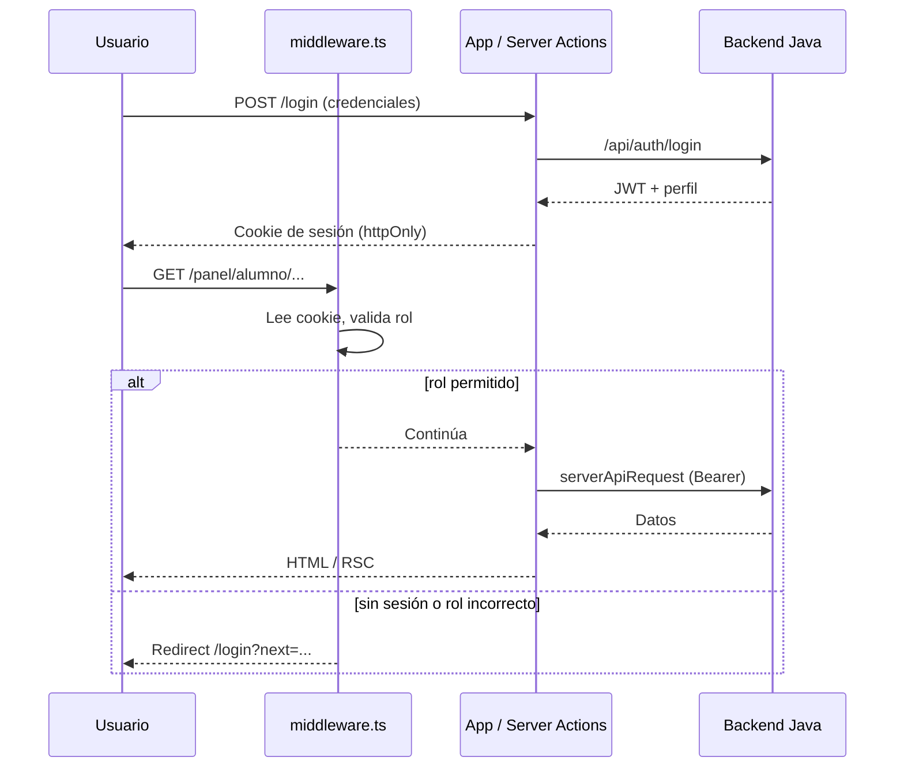
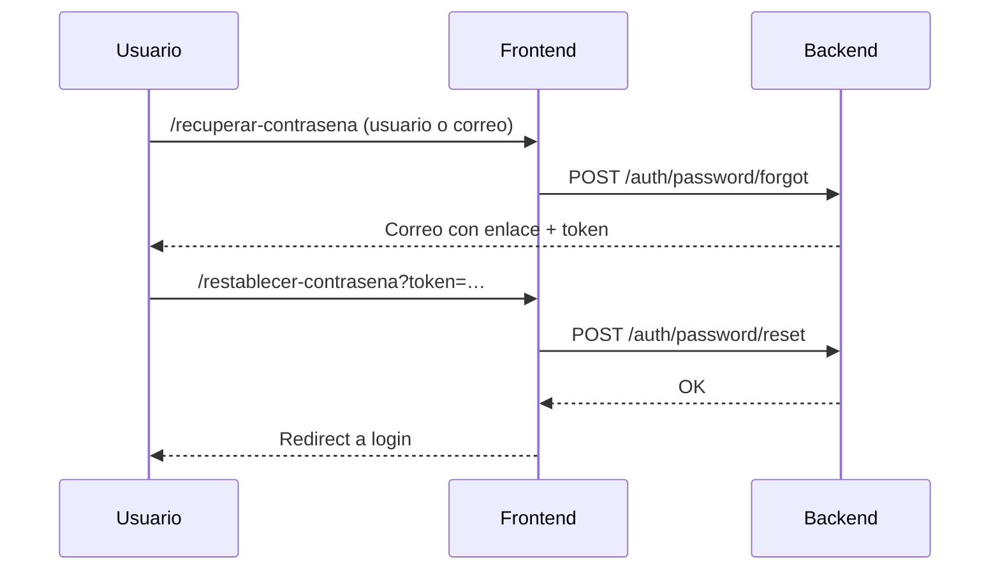
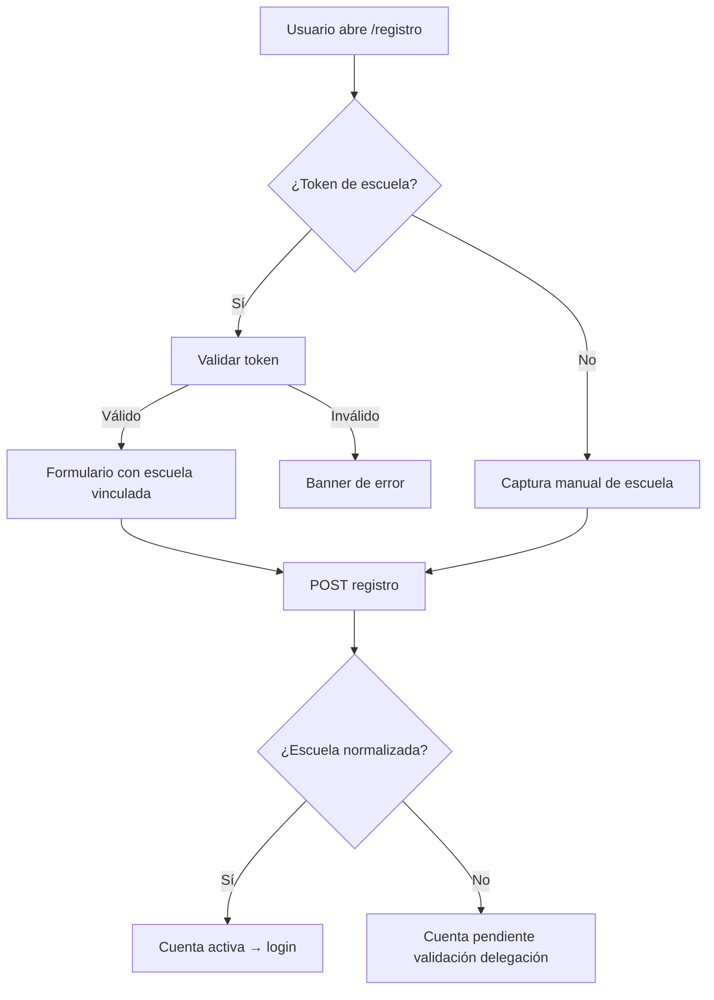
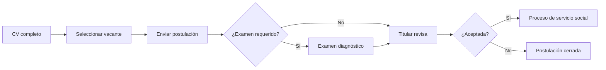
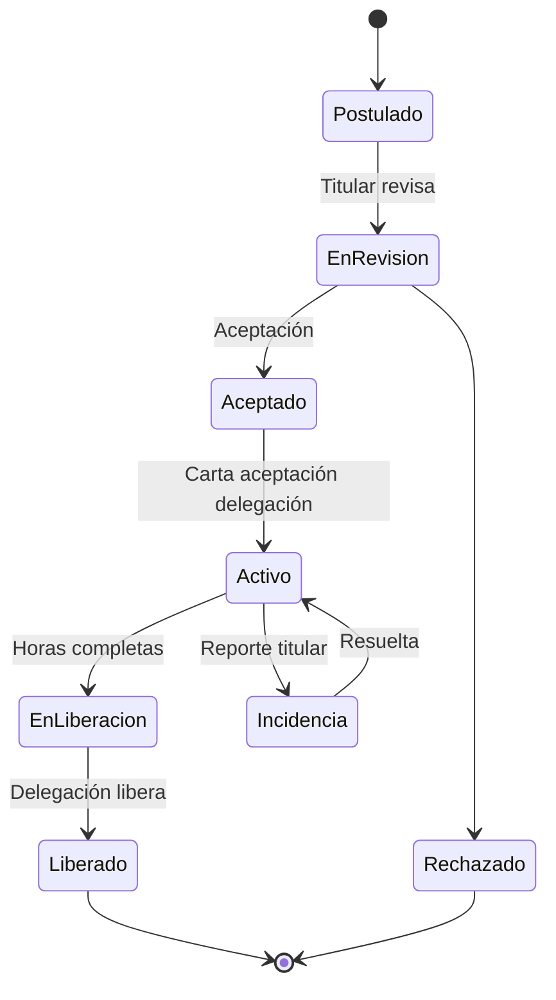
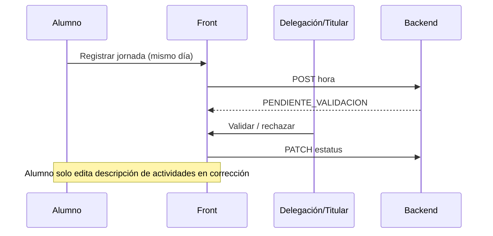
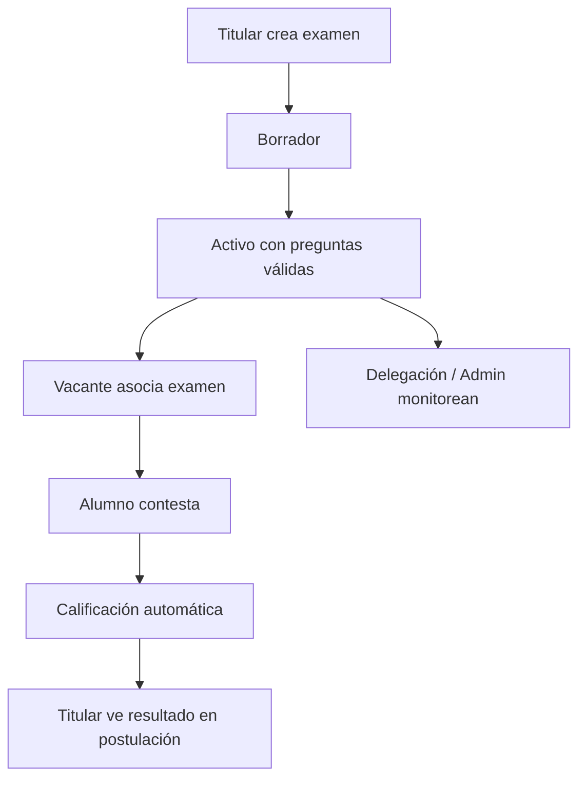
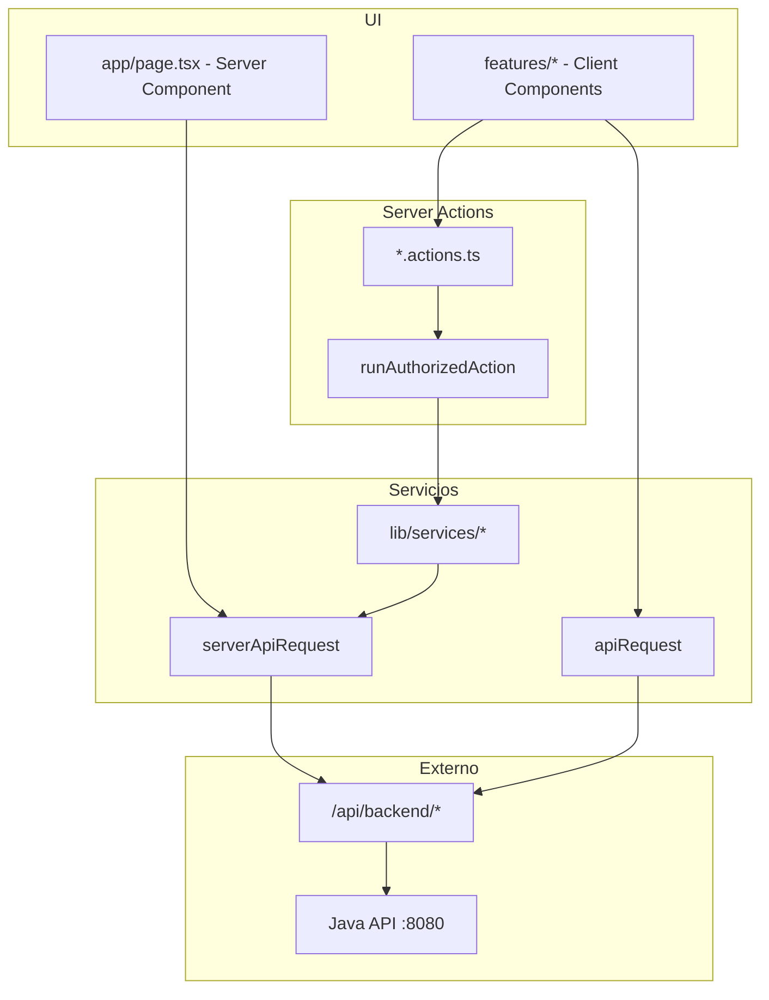

# Flujos del sistema — Servicio Social Edomex

Documentación gráfica de sesiones, roles, flujos de negocio y relaciones entre módulos del frontend.

Complementa [ARQUITECTURA.md](./ARQUITECTURA.md).

---

## 1. Roles y permisos



| Rol | Ruta base | Responsabilidad principal |
|-----|-----------|---------------------------|
| `ALUMNO` | `/panel/alumno` | CV, postulación, proceso activo |
| `TITULAR` | `/panel/titular` | Vacantes, postulaciones, seguimiento |
| `DELEGACION` | `/panel/delegacion` | Publicación, validación, liberación |
| `ADMIN` | `/panel/admin` | Catálogos globales |
| `ENLACE` | `/panel/enlace` | Consulta escolar read-only |

---

## 2. Sesión y autenticación



### Reglas de sesión (frontend)

1. **Cookie httpOnly** — el token no se expone al JavaScript del navegador.
2. **`middleware.ts`** — primera línea de defensa: rutas `/panel/*` exigen sesión y rol.
3. **Server Actions** — segunda línea: `runAuthorizedAction` valida rol antes de llamar al API.
4. **Redirects seguros** — `isSafeInternalPath` evita open redirects en `?next=`.
5. **El backend es la autoridad** — el front solo oculta UI; toda mutación debe rechazarse en API si el rol no aplica.

### Recuperación de contraseña



Archivos: `src/features/auth/reset-password/`, `password-reset.service.ts`.

Archivos clave:

- `src/middleware.ts`
- `src/lib/auth/` — roles, redirects, postulación, CV
- `src/lib/actions/run-authorized-action.ts`

---

## 3. Flujo de registro de alumno



**Reglas de negocio:**

- Con token: la escuela queda vinculada automáticamente.
- Sin token: `escuelaTextoCapturada` requiere normalización por delegación antes de postularse.
- Aviso de privacidad obligatorio.

---

## 4. Flujo de postulación (alumno)



**Guards en front:**

- `hasAlumnoCvPostulacionMotivo` — redirige a CV si intenta postular sin completarlo.
- `postulacion-entry` — rutas de entrada unificadas.
- Dominio en `src/lib/domain/cv.ts` — campos obligatorios del CV.

---

## 5. Ciclo de vida del proceso



### Horas de servicio



Componentes compartidos: `src/shared/proceso/horas/` (calendario, utilidades, modal alumno/titular).

---

## 6. Exámenes diagnóstico



Servicios compartidos:

- `src/lib/services/examenes-monitor.service.ts`
- `src/lib/actions/examenes-monitor.actions.ts` (roles `DELEGACION` + `ADMIN`)
- `src/shared/components/examen/ExamenesMonitorView.tsx`

---

## 7. Capas de datos



---

## 8. Seguridad en el front

| Control | Ubicación |
|---------|-----------|
| Headers (CSP, HSTS prod, X-Frame-Options) | `next.config.ts` |
| Middleware de roles | `src/middleware.ts` |
| Guards en actions | `runAuthorizedAction` |
| Paths internos seguros | `isSafeInternalPath` |
| Sin `poweredBy` | `next.config.ts` |

**Limitación conocida:** el proxy `/api/backend` expone el API al navegador para llamadas cliente; el backend debe autorizar cada endpoint.

---

## 9. Comandos de calidad

```bash
npm run typecheck   # tsc --noEmit
npm run lint        # ESLint
npm run check       # typecheck + lint
npm run build       # Build producción
```

CI: `.github/workflows/ci.yml` ejecuta los tres en cada PR.

---

## 10. Índice de reglas de negocio por módulo

| Módulo | Archivo dominio |
|--------|-----------------|
| CV alumno | `src/lib/domain/cv.ts` |
| Horas | `src/lib/domain/horas.ts` |
| Proceso / estatus | `src/lib/domain/proceso.ts` |
| Postulación | `src/lib/domain/postulacion.ts` |
| Examen | `src/lib/domain/examen.ts` |
| Etiquetas / fechas | `src/lib/domain/labels.ts` |

Export central: `src/lib/domain/index.ts`.
