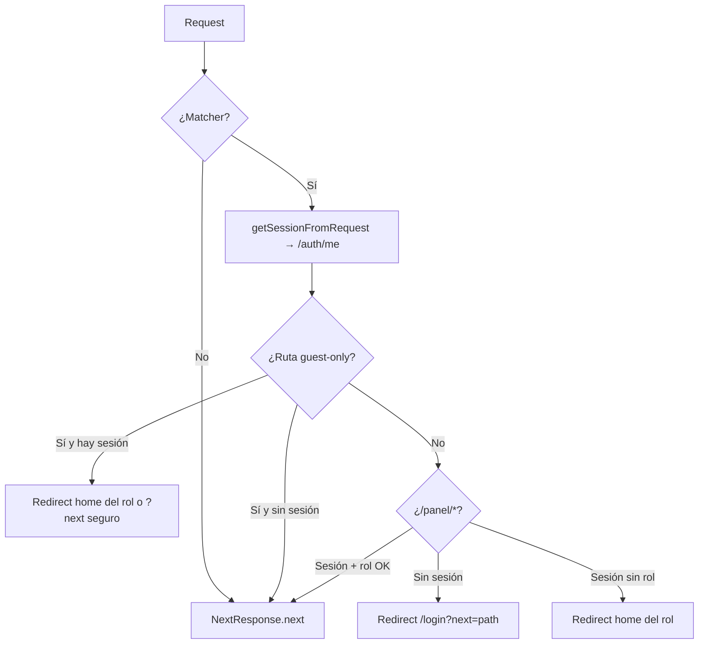
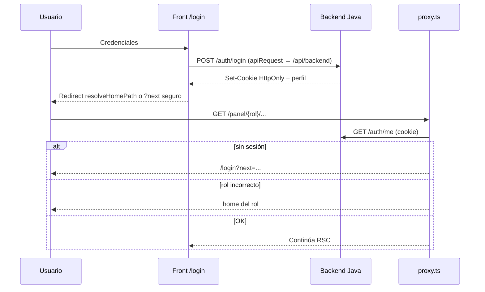
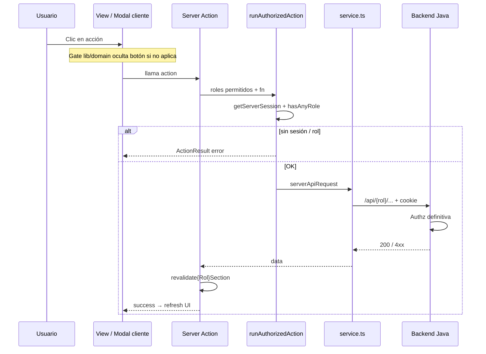
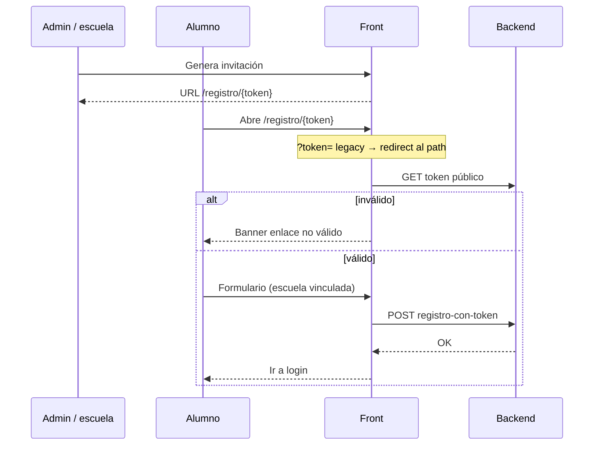
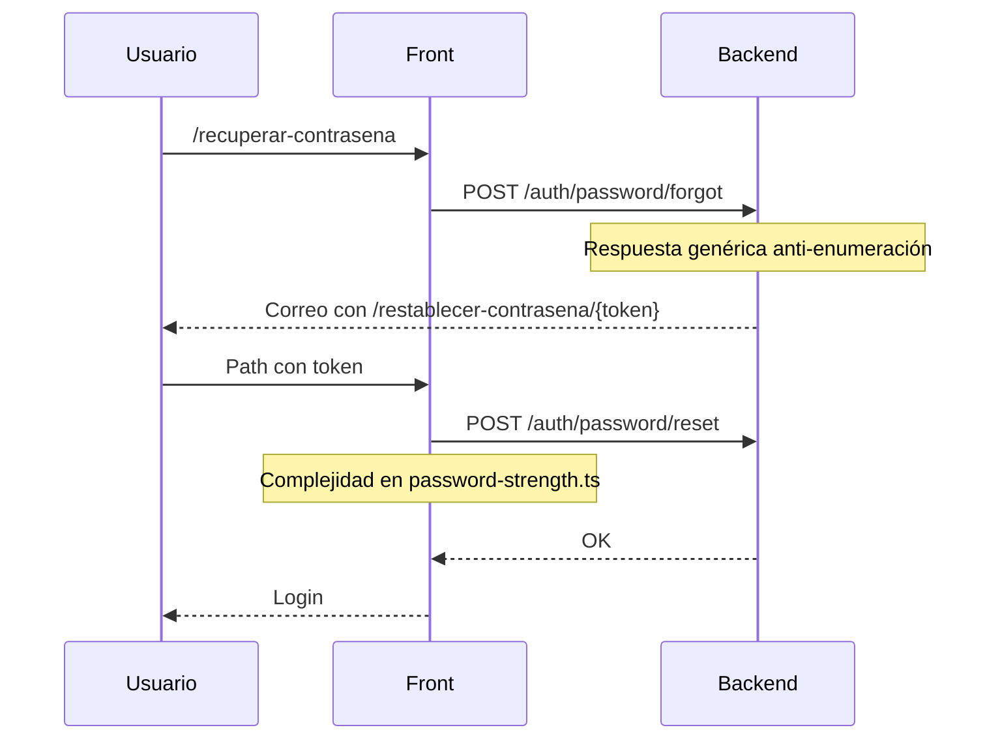
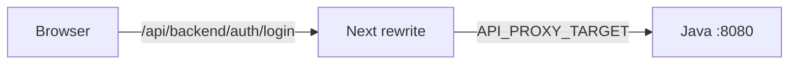

# Seguridad del frontend

Cómo funciona la seguridad en `front-servicio-social`: capas, flujos y checklists.

La **autorización definitiva** siempre vive en el backend Java. El front añade **defensa en profundidad** (proxy, actions, headers, tokens en path).

Complementa [ARQUITECTURA.md](./ARQUITECTURA.md) §9–10, [FLUJOS.md](./FLUJOS.md) §2 y [DEPLOY.md](./DEPLOY.md).

---

## 1. Principios

| # | Principio | Qué implica |
|---|-----------|-------------|
| 1 | **Backend manda** | Cada endpoint valida sesión y rol. El front no es la única barrera. |
| 2 | **Sesión en cookie** | No hay tokens de auth en `localStorage`. Cookie `HttpOnly` (la define el backend). |
| 3 | **Mutaciones por server action** | El panel no llama `serverApiRequest` / `apiRequest` desde `*View` / `*Modal`. |
| 4 | **Tokens sensibles fuera del query** | Registro y reset usan path (`/registro/{token}`, `/restablecer-contrasena/{token}`). |
| 5 | **HTTPS en producción** | Obligatorio para cookies `Secure` y HSTS. |
| 6 | **Gates en dominio** | La UI oculta acciones con `lib/domain/`; el backend vuelve a validar. |

---

## 2. Capas de defensa (mapa mental)

```mermaid
flowchart TB
  subgraph browser [Navegador]
    UI[UI pública / panel]
  end

  subgraph next [Next.js front]
    HDR[Headers CSP HSTS XFO]
    PX[proxy.ts]
    SA[runAuthorizedAction]
    SVC[serverApiRequest / apiRequest]
    RW[rewrite /api/backend]
  end

  subgraph java [Backend Java]
    AUTH[Auth + cookies]
    AUTHZ[Autorización por endpoint]
    DATA[(Datos)]
  end

  UI --> HDR
  UI --> PX
  PX -->|panel sin sesión / rol incorrecto| LOGIN[/login]
  PX -->|OK| UI
  UI -->|mutación panel| SA
  SA -->|sesión + rol| SVC
  SVC --> RW
  RW --> AUTH
  AUTH --> AUTHZ
  AUTHZ --> DATA
```

| Capa | Archivo | Qué bloquea |
|------|---------|-------------|
| Headers | `next.config.ts` | Clickjacking, MIME sniff, CSP, HSTS (prod) |
| Proxy de rutas | `src/proxy.ts` | Acceso a `/panel/*` sin sesión; guest-only si ya hay sesión |
| Actions | `runAuthorizedAction` | Mutación sin rol correcto |
| Dominio UI | `src/lib/domain/` | Botones/acciones que no aplican al estatus |
| Backend | API Java | Última palabra en authz |

---

## 3. Controles implementados

| Control | Dónde | Qué hace |
|---------|-------|----------|
| Proxy de roles | `src/proxy.ts` | Protege `/panel/*`; guest-only en login/registro/reset |
| Guards en actions | `runAuthorizedAction` | Exige sesión + rol antes de mutar |
| Paths internos seguros | `isSafeInternalPath` | Evita open-redirect en `?next=` |
| Headers HTTP | `next.config.ts` | CSP, HSTS (prod), `X-Frame-Options`, `nosniff`, `Permissions-Policy` |
| Tokens en path | `registro/[token]`, `restablecer-contrasena/[token]` | Menos fuga por Referer/historial |
| `Referrer-Policy: no-referrer` | rutas con token | Evita filtrar token en Referer |
| Payloads limpios | `compactPayload()` | No envía `undefined` → `"$undefined"` a server actions |
| Límite de body | `serverActions.bodySizeLimit: "2mb"` | Acota uploads (UI alineada a 2 MB) |
| Fronteras de código | `eslint.config.mjs` | Sin imports cruzados entre features de rol |
| `robots` / `noindex` | `robots.ts` + metadata auth/panel | No indexar panel ni auth |
| Health | `GET /api/health` | Liveness + backend `up`/`down` |
| Errores | `instrumentation.ts` + Sentry opcional | Trazas si hay DSN |

---

## 4. Cómo funciona — flujos de seguridad

### 4.1 Proxy: ¿quién puede entrar a qué?

Matcher: `/panel/:path*`, `/login`, `/registro`, `/registro/:path*`, `/recuperar-contrasena`, `/restablecer-contrasena/:path*`.



**Guest-only** (`GUEST_ONLY_PATHS`): `/login`, `/registro`, `/recuperar-contrasena`, `/restablecer-contrasena`.  
Si ya hay cookie válida, el usuario no se queda en esas pantallas: va a su panel (o a `?next=` si es path interno seguro).

Archivos: `src/proxy.ts`, `src/lib/auth/session.middleware.ts`, `guest-redirect.ts`, `roles.ts`.

---

### 4.2 Login y cookie de sesión



Reglas:

1. Cookie `HttpOnly` — no accesible desde JS.
2. `?next=` solo si `isSafeInternalPath` (sin `//`, sin protocolo externo).
3. El proxy **no** autoriza endpoints de negocio; solo enruta por rol de panel.

---

### 4.3 Mutación del panel (doble check)



Checklist al crear una mutación: §6.B abajo.

---

### 4.4 Registro con token de escuela



Mitigaciones: token en **path**, `Referrer-Policy: no-referrer`, no loguear el token.

---

### 4.5 Recuperación de contraseña



---

### 4.6 Headers y superficie pública

```mermaid
flowchart LR
  REQ[Request HTTPS] --> NC[next.config headers]
  NC --> CSP[CSP]
  NC --> HSTS[HSTS prod]
  NC --> XFO[X-Frame-Options DENY]
  NC --> MIME[X-Content-Type-Options]
  NC --> PP[Permissions-Policy]

  PUB[/ vacantes] --> IDX[Indexable]
  PANEL[/panel /login ...] --> NOIDX[noindex + robots disallow]
```

| Header | Valor relevante |
|--------|-----------------|
| CSP | `default-src 'self'`; prod sin `unsafe-eval`; `script-src-attr 'none'` |
| HSTS | Solo producción |
| Referrer | `strict-origin-when-cross-origin` global; `no-referrer` en rutas con token |

---

### 4.7 Proxy HTTP `/api/backend` (no confundir con `proxy.ts`)

Hay **dos** “proxies”:

| Nombre | Qué es |
|--------|--------|
| **`src/proxy.ts`** | Guard de **rutas** Next 16 (auth/roles) |
| **Rewrite `/api/backend`** | En `next.config.ts`: el browser habla con el front; Next reenvía al Java (`API_PROXY_TARGET`) |



El rewrite **no** autoriza. Todo endpoint debe validar cookie/rol en Java.

---

## 5. Fronteras de código (seguridad de arquitectura)

ESLint (`eslint.config.mjs`) impide que un feature de rol importe otro:

- `features/alumno` ✗→ `features/titular`
- `features/landing` ✗→ `features/admin`
- Permitido: `lib/`, `shared/`, `features/panel`, `features/auth` (según caso)

Gates de negocio viven en `src/lib/domain/` (ej. `canAlumnoPostularVacante`, `canOcultarEncuesta`).

---

## 6. Checklists objetivos

### A. Antes de cada release

1. [ ] Backend en prod con cookies `HttpOnly` + `Secure` + `SameSite`.
2. [ ] HTTPS activo en el dominio público.
3. [ ] `API_PROXY_TARGET` apunta al API interno correcto.
4. [ ] `NEXT_PUBLIC_SITE_URL` es el dominio real.
5. [ ] `npm run check` + `npm run test:coverage` + `npm run build` en verde.
6. [ ] Smoke: login por rol + 1 mutación crítica ([PANEL_PHASE0_BASELINE.md](./PANEL_PHASE0_BASELINE.md)).

### B. Al desarrollar una mutación del panel

1. [ ] `actions/*.actions.ts` con `"use server"`.
2. [ ] `runAuthorizedAction([USER_ROLES.…], …)`.
3. [ ] Servicio con `serverApiRequest` (nunca desde el cliente).
4. [ ] Payload con `compactPayload()` / `normalizeOptional*` (sin `undefined`).
5. [ ] Tras éxito: `revalidate{Rol}Section(…)` (+ `router.refresh()` si aplica).
6. [ ] UI: gates de `lib/domain/` antes de mostrar el botón.

### C. Al tocar auth / tokens

1. [ ] Invitación escuela → `/registro/{token}`.
2. [ ] Reset → `/restablecer-contrasena/{token}`.
3. [ ] `?token=` legacy → redirect al path (ya implementado).
4. [ ] No loguear tokens.
5. [ ] Mantener `Referrer-Policy: no-referrer` en esas rutas.

### D. Al desplegar

1. [ ] Revisar CSP en prod (sin `unsafe-eval`).
2. [ ] Opcional: `NEXT_PUBLIC_SENTRY_DSN` (+ `SENTRY_AUTH_TOKEN` para source maps).
3. [ ] Rate limit / WAF en `/auth/*` (backend o edge).
4. [ ] Docker: standalone, no-root, `HEALTHCHECK` ([DEPLOY.md](./DEPLOY.md)).

---

## 7. Limitaciones conocidas

| Tema | Estado | Mitigación |
|------|--------|------------|
| Rewrite `/api/backend/*` visible al browser | Por diseño (auth cliente) | Backend autoriza **todo** endpoint |
| CSP `script-src 'unsafe-inline'` | Next App Router sin nonces | `script-src-attr 'none'`; HSTS; sin `unsafe-eval` en prod |
| CSRF explícito en front | No hay token CSRF propio | `SameSite` + cookies del backend |
| Convención Next 16 | `proxy.ts` | Migrado desde `middleware.ts` |
| Sentry | Opcional | Configurar DSN en prod si se requiere APM |

---

## 8. Qué NO hacer

- No guardar JWT/sesión en `localStorage` o `sessionStorage`.
- No llamar `apiRequest` / `serverApiRequest` desde un `*View` / `*Modal` del panel.
- No poner tokens de registro/reset en query string en enlaces nuevos.
- No confiar solo en ocultar botones: el backend debe rechazar la operación.
- No desactivar HTTPS, HSTS o CSP en producción “para probar”.
- No importar features de un rol desde otro rol.
- No commitear `.env.local` ni credenciales reales.

---

## 9. Archivos de referencia

| Tema | Archivo |
|------|---------|
| Headers / CSP / rewrite API | `next.config.ts` |
| Guard de rutas | `src/proxy.ts` |
| Roles y paths | `src/lib/auth/constants.ts`, `roles.ts` |
| Actions autorizadas | `src/lib/actions/run-authorized-action.ts` |
| Payloads | `src/lib/actions/normalize-server-args.ts` |
| Dominio / gates | `src/lib/domain/` |
| Fronteras ESLint | `eslint.config.mjs` |
| Invitación registro | `src/features/admin/components/escuelas/invitation-link.ts` |
| Reset password | `src/features/auth/reset-password/` |
| Política contraseña | `src/features/auth/validation/password-strength.ts` |
| Health | `src/app/api/health/route.ts` |
| Sentry | `src/instrumentation.ts`, `sentry.*.config.ts` |

---

*Actualizado: proxy Next 16, capas de defensa, flujos Mermaid de seguridad, ESLint boundaries, upload 2 MB.*
